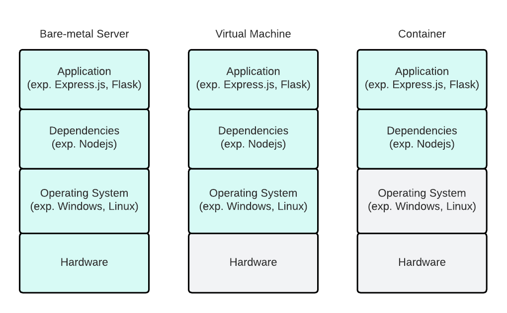
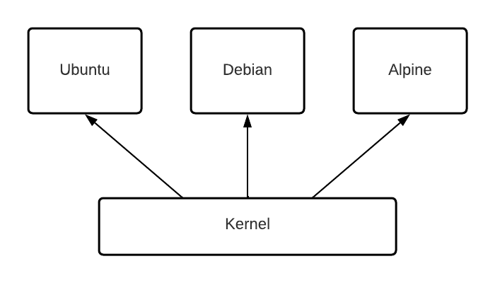

# Docker

**What and why do I need docker?**

Docker is a tool where you include all the necessary things you need to start an application. Imagine you are developing a Nodejs application. The application works just fine on your machine and you send it to your friend to showcase your work. But suddenly the application didn’t run on their machine! You immediately try to fix the problem and discovered several issues:

- Your application required Node version 16 and on your friend machine only version 14 is available
- Also since your friend is new to programming, he doesn’t know how to start the application. He doesn’t know all the commands that you normally execute like “npm install” and “npm start”.

To solve the first problem you could update Node to version 16, but what if there are multiple other projects and each of them required a different version of Node? Installing all possible Node versions could be a solution but that would be really hard to manage. Every time you start the application, you need to switch the Node version on your machine. Additionally all those Node versions would take a lot of storage space on your machine.

For the last problem you could teach your friends all those commands that he needs to execute. But imagine the application is really big and you need to execute 10 - 20 commands to start the application. Every time that the application needs to run on a different machine, all those commands need to be manually execute again. That would be really repetitive and prone to error.

To solve all problem you could use Docker. With Docker you can include the runtime and also all the necessary executing commands to start the application.



Capabilities of Docker

**Docker Concept**

Back in the old days, when Docker didn’t exist, people use virtual machines (vm). For each application you would create a new virtual environment for it. The application then runs inside this virtual hard- and software environment. It works for a while but then it turns out to not really being efficient. Imagine you have two applications that both utilize the same operating system Ubuntu. With VM you would create two ubuntu instance and let the application run separately on both VMs. There is a redundancy on the operating system level and it takes a lot of storage away. With Docker you won’t have redundancy on the operating system layer and only virtualize the application and its environments.

**What are Dockerfile, images and containers?**

In Docker the first step you would do is to define a Dockerfile. The Dockerfile is like a cooking recipe where you write all the necessary steps how to start the application and also which environment the application needs.

After you write the Dockerfile, Docker will try to follow all the instructions and setup the environment and the runtime, install all the packages, etc. The process is called building and the end result is a Docker image. Docker image contains everything the application needs to run.  

Docker container and docker image are almost the same thing. The docker container is just a running instance of a docker image! But be careful, a stopped container is not a docker image through! Docker image is read-only, immutable and represent the application at specific point at time. Docker container is mutable and is stateful.

**Start with Docker**

To start with Docker, you need to create a Dockerfile in your application folder. Be aware that the Dockerfile doesn’t have any extensions like .txt or .json, it’s just “Dockerfile”. Here is an example of a Dockerfile:

```docker
# 1. select a base image
FROM node:17-slim
# 2. define a workdir in the container
WORKDIR /app

# 3. copy file from your machine to the the folder /app/
COPY . /app/
# 4. install dependencies
RUN npm install
# 5. execute commands to start the application
CMD [ "npm", "start" ]
```

**Docker Cache**

Imagine you did a little code change. If you change your code and want to run the code in the container again, you would need to rebuild the container. With the Dockerfile right now, Docker would copy all your code and install all the packages in the package.sjon again, even through there aren’t any change. The download of the packages could be really long depending on how many packages there are. To speed up the process you could leverage cache by defining the step of installing the packages before you copy your code. This way Docker would recognize that there aren’t any change with the packages and would skip the installing step, though making the building process of the image faster.

```docker
FROM node:17-slim

WORKDIR /app
# this will be cached
COPY package.json /app/
RUN npm install
# docker only copy the code again
COPY . /app/
CMD [ "npm", "start" ]
```

After you define your Dockerfile you can build the image out of it and give it a tag (name).

```bash
# build image (-t stands for tag/name)
docker build -t imagename .
# create container 
docker run imagename
```

**Other question that you might ask**

**How it is possible that you can include an operating system into the container? Wouldn’t that make the container really big?**

All operating system (at least in the linux ecosystem) are based on the same kernel. The kernel is the layer above the hardware and has direct access to it. It is the first program that is loaded after the bootloader and is responsible for low-level tasks such as memory management or task management. All distributions have the same base, the only difference between those distributions is that each distributions have different files.



In the docker image, you just include the operating system files that the operating system has. The kernel isn’t included and through that, the image stays lightweight.

**What is Docker hub?**

Its a registry where you can share your docker image. It’s also the place where you can find a base image for your application. It’s comparable to Github, but just for Docker images.

**What is Docker compose?**

Docker compose is used when you want to start multiple containers at the same time. You define the steps how to build all the different containers and docker compose will handle the rest. It’s really convenient since you can start multiple containers at the same time with only one command!

```bash
# to build the containers
docker-compose build
# to start the containers
docker-compose up
# to take down the containers
docker-compose down
```